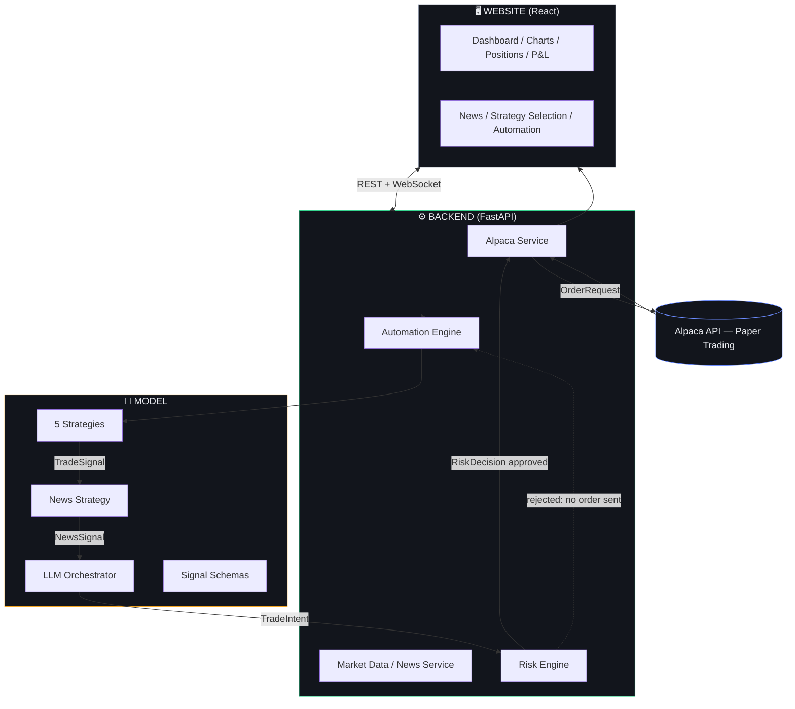

# Signal/Terminal — AI Trading Agent Platform for Alpaca (Paper Trading)

A hackathon-ready scaffold for an autonomous AI trading agent built on
Alpaca's **paper-trading** API. Connect an Alpaca paper account, pick a
strategy, choose the assets it's allowed to touch, and run an automation
loop where every AI-generated trade idea passes through a deterministic
risk engine before it can reach the broker.

**This is a scaffold.** The five trading strategies are intentionally left
as clean, typed stubs — see [`model/README.md`](./model/README.md) for how
to implement them.

---

## 1. Project overview

```
project-root/
├── website/     React + Vite frontend — the trading terminal UI
├── model/       Strategy stubs, schemas, news stub, LLM orchestrator stub
├── backend/     FastAPI backend — Alpaca integration, risk engine, automation engine
├── .env.example
├── requirements.txt
└── README.md
```

- **`/website`** never talks to Alpaca directly. It only calls the backend's
  REST/WebSocket API.
- **`/model`** never talks to Alpaca directly. It only produces structured
  Pydantic objects (`TradeSignal`, `TradeIntent`).
- **`/backend`** is the only layer that holds Alpaca credentials or calls
  the Alpaca SDK, and it only submits an order after the risk engine has
  approved it.

## 2. Architecture



**The one rule that never bends:** the LLM Orchestrator can never call
Alpaca directly, and it can never bypass the Risk Engine. Every trade —
however confident the model is — is just a structured `TradeIntent` until
the deterministic Risk Engine says otherwise.

## 3. Installation

### Prerequisites
- Python 3.11+
- Node.js 18+
- An [Alpaca paper-trading account](https://app.alpaca.markets/signup) and API keys

### Backend

```bash
cd backend
python -m venv .venv && source .venv/bin/activate
pip install -r ../requirements.txt
cp ../.env.example ../.env   # fill in values, or connect interactively via the UI
uvicorn app.main:app --reload --port 8000
```

### Frontend

```bash
cd website
npm install
npm run dev
```

The frontend dev server proxies `/api` and `/ws` to `http://localhost:8000`
(see `website/vite.config.js`), so run the backend first.

## 4. Environment variables

See [`.env.example`](./.env.example). Nothing is required to boot the app —
you can connect Alpaca credentials interactively through the Connect
screen, which stores them only in a server-side session
(`backend/app/services/session_store.py`), never in the frontend or on
disk.

```
ALPACA_API_KEY=        # optional — or connect via the UI
ALPACA_SECRET_KEY=      # optional — or connect via the UI
ALPACA_PAPER=true       # always true for this hackathon build

LLM_API_KEY=            # required once you wire up model/orchestrator/llm_orchestrator.py
NEWS_API_KEY=           # required once you wire up backend/app/services/news_service.py
```

## 5. Alpaca / paper-trading setup

1. Create a free account at [alpaca.markets](https://alpaca.markets).
2. Generate a **paper trading** API key/secret from the Alpaca dashboard.
3. Enter them on the Connect screen (`/connect`), or set them in `.env`.
4. The app never lets you trade live — `paper` is hardcoded `true` at the
   UI layer and the "PAPER TRADING" badge is always visible.

## 6. Frontend / backend startup

Already covered in §3. In short: backend on `:8000`, frontend on `:5173`,
frontend proxies API calls to the backend.

## 7. Strategy architecture

Every strategy lives in `model/strategies/` and implements the
`BaseStrategy` interface (`initialize`, `analyze`, `generate_signal`). Each
one has a Pydantic `*Config` class that the frontend's configuration form
renders automatically. None of the five strategies contain real trading
logic — they're stubs with `TODO(you)` markers. See
[`model/README.md`](./model/README.md) for the full contract and for how
to add a brand-new strategy without touching the frontend.

## 8. LLM orchestrator architecture

`model/orchestrator/llm_orchestrator.py` fuses a strategy's `TradeSignal`
with a `NewsSignal` and portfolio/risk context into a `TradeIntent`. It's
also a stub — no LLM provider or API key is hardcoded. Wire up your
provider of choice via `LLM_API_KEY` and a concrete `LLMProvider`
subclass.

## 9. Risk engine

`backend/app/services/risk_engine.py` is fully implemented and
deterministic — no LLM calls, no probabilistic logic. It checks, in order:
kill switch, asset allowlist, strategy permission, duplicate orders, max
order size, max position %, max portfolio exposure %, buying power, daily
loss limit, and max trades/day. A `TradeIntent` only becomes an
`OrderRequest` after every check passes.

## 10. Automation flow

```
START → market data → strategy.analyze/generate_signal → news_strategy
      → llm_orchestrator → risk_engine.evaluate → (approved) alpaca.submit_order
      → decision logged → dashboard updates
```

Controlled via `POST /api/automation/{start,pause,resume,stop,emergency-stop}`.
The engine's state machine is `IDLE → RUNNING ⇄ PAUSED → STOPPED`, with
`EMERGENCY_STOPPED` reachable from any state and engaging the risk engine's
kill switch.

## 11. How to implement a strategy

Open the relevant file in `model/strategies/`, fill in `analyze()` and
`generate_signal()`, keep the method signatures and `TradeSignal` output
unchanged. That's it — the backend, risk engine, and frontend all pick up
real signals automatically once a strategy stops returning `None`.

## 12. How to add a new strategy

1. Create `model/strategies/your_strategy.py` subclassing `BaseStrategy`.
2. Register it in `model/strategies/registry.py`.
3. It appears in the UI automatically via `GET /api/strategies` — no
   frontend changes needed.

## 13. Security considerations

- Alpaca credentials are sent once to `POST /api/alpaca/connect`, validated
  against Alpaca, then held **only** in an in-memory, server-side session
  keyed by an httpOnly cookie. They are never returned to the frontend,
  never logged, never written to disk, and `.env.example` contains
  placeholders only.
- The risk engine is the sole gate before any order reaches Alpaca; the LLM
  orchestrator cannot bypass it.
- Emergency stop engages a kill switch that blocks all further orders
  regardless of automation state.
- All automation defaults to Alpaca's paper-trading environment; the UI
  always displays a "PAPER TRADING" badge.

## 14. Known limitations (by design)

- **Funding-rate arbitrage** and **cross-exchange arbitrage** cannot fully
  execute using Alpaca alone — Alpaca has no perpetuals/funding-rate data
  and is a single execution venue. Both strategies are marked
  `requires_external_venue` in the registry and surfaced as such in the UI.
- News and LLM features return honest "unavailable" states until you
  configure `NEWS_API_KEY` / `LLM_API_KEY` and implement the corresponding
  provider — no fabricated data, ever.
